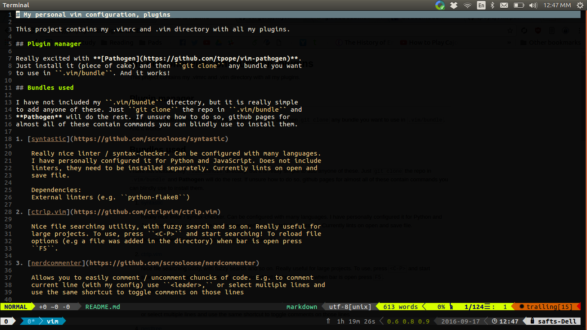
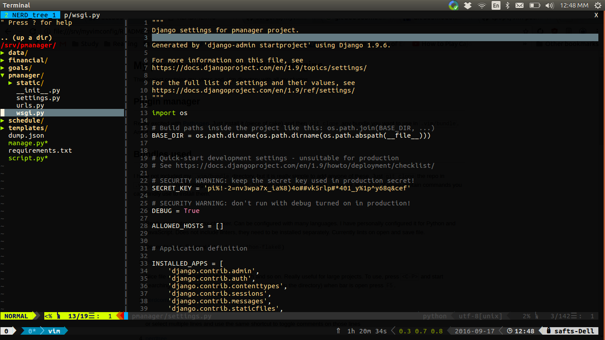
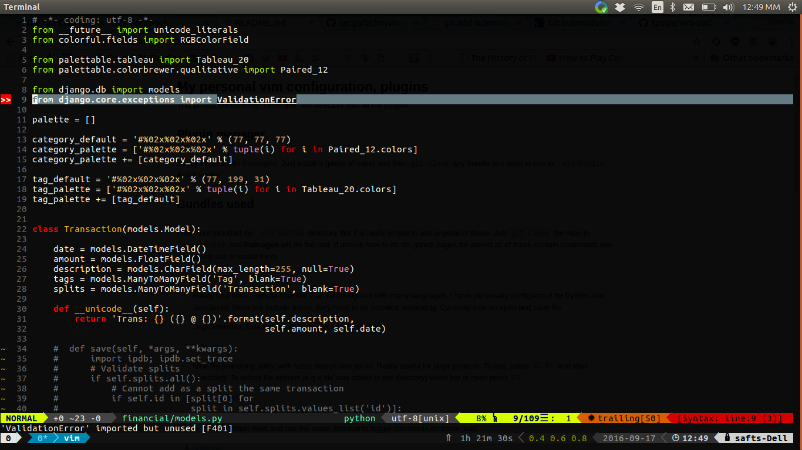
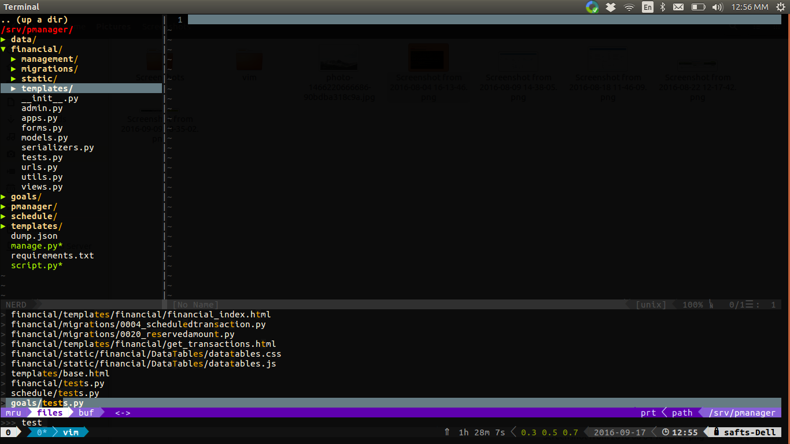

# My personal vim configuration, plugins

This project contains my .vimrc and .vim directory with all my plugins.

## Plugin manager

Really excited with **[Pathogen](https://github.com/tpope/vim-pathogen)**.
Just install it (piece of cake) and then ``git clone`` any bundle you want
to use in ``.vim/bundle``. And it works!

## Bundles used

I have not included my ``.vim/bundle`` directory, but it is really simple
to add anyone of these. Just ``git clone`` the repo in ``.vim/bundle`` and
**Pathogen** will do the rest. If unsure how to do so, github pages for 
almost all of these contain commands you can blindly use to install them.

1. [syntastic](https://github.com/scrooloose/syntastic)

    Really nice linter / syntax-checker. Can be configured with many languages.
    I have personally configured it for Python and JavaScript. Does not include
    linters, they need to be installed separately. Currently lints on open and
    save file.

    Dependencies:
    External linters (e.g. ``python-flake8``)

2. [ctrlp.vim](https://github.com/ctrlpvim/ctrlp.vim)

    Nice file searching utility, with fuzzy search and so on. Really useful for
    large projects. To use, press ``<C-P>`` and start searching! To reload file 
    options (e.g a file was added in the directory) when bar is open press 
    ``F5``.

3. [nerdcommenter](https://github.com/scrooloose/nerdcommenter)

    Allows you to easily comment / uncomment chuncks of code. E.g. to comment
    current line (with my config) use ``<leader>,`` or select multiple lines and
    use the same shortcut to toggle comments on those lines

4. [nerdtree](https://github.com/scrooloose/nerdtree)

    File explorer sidebar. Lists files in current directory, allows add / move
    / delete operations. To toggle press <C-N>, to open file management options
    press ``m``

5. [vim-python-pep8-indent](https://github.com/hynek/vim-python-pep8-indent)

    Indent in PEP8 while writing.

6. [vim-airline](https://github.com/vim-airline/vim-airline)

    Great statusbar, highly customizable. 

7. [vim-gitgutter](https://github.com/airblade/vim-gitgutter)

    Shows marks for unstaged changes in currently open file

8. [vim-javascript](https://github.com/pangloss/vim-javascript)

    Syntax highlighting - improved indentation for JavaScript

9. [vim-javascript-syntax](https://github.com/jelera/vim-javascript-syntax)

    Improvements on vim-javascript

10. [vim-jsx](https://github.com/mxw/vim-jsx)

    JSX syntax for vim (e.g if you are using ReactJS)

## Plugins

1. [Matchit](https://github.com/tmhedberg/matchit)

    Improved ``%`` matching. Really nice, can help match html tags and so on.
    Tip: When matching a ``
``, press ``%`` with the cursor on the ``div``
    and not on the ``<`` or ``>``. Yeah, might seem obvious. Then again maybe
    not.

## Color schemes

1. [Monokai-Refined](https://github.com/jaromero/vim-monokai-refined)

    Coming from Sublime Text, I really needed something to make me feel at 
    home, at least until I figured out how to say.. exit vim. This did the
    trick.

2. [badwolf](https://github.com/sjl/badwolf)

    My current vim color scheme. Love it. Try it out.

## File Type plugins

1. [django.vim / htmldjango.vim](http://www.vim.org/scripts/script.php?script_id=1487)

    Syntax highlighting for Django templates

# Performance

Some features can make VIM a bit slow on large files. E.g. I have 
experienced issues with large ``.yaml`` files. Disabling the syntax
(``:sy off``) can really help

My configuration for Syntastic lints the file on open / write. This
may also slow down your editor (especially over ``sshfs``)

# Do I really need all this??

The answer is NO. And you probably don't need half the stuff in my ``.vimrc``
either. The greatest thing with VIM for me is that you get to **build** it. 
So do that :) The best way for you to get a nice VIM experience is to start
from scratch and start slowly adding bundles - configuration bits. This way
you really know what is going on, why this is required and so on.

Building this took me over 5 months, and it is not even close to complete
yet (Did you notice there are no references to code completion? **EDIT**:
Some basic is provided with ``<C-P>`` but I have not even scratched this topic)
I believe it is essential that you take it step-by-step and create your
own config, tailored for your needs. 

I hope I helped a bit! Happy coding everyone :) And stay away from IDEs! 

# Screenshots

Screenshot of editing this README

NerdTree open

Python file with syntax errors and unstaged git changes

ctrlp bottom panel open

